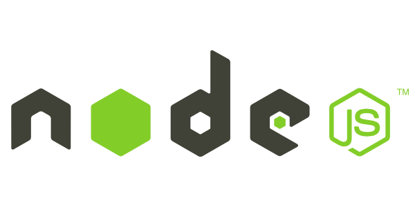

# [REST API - Setting up a Node.js development environment with Express.js](#rest-api---setting-up-a-nodejs-development-environment-with-expressjs)

*December 2020*

> 🔨 ResFul API in NodeJS+Express to manage a list of members. From udemy '[Apprendre Node.js & Créer une API REST de A à Z ! - Bryan P.](https://www.udemy.com/course/nodejs-api-rest/)'. Demo on [Heroku](https://raigyo-node-members-front.herokuapp.com/members).



This application is a simple resful API to manage members (CRUD). There is also a front-end part to test the CRUD from client side.

The backend part use a *Members* class containing request GET/PUT/POST/DELETE to MySQL database with promises
*app.js* just call the right methods from *Members* using async/await. The idea is to have a clear, reausable and portable code without dozens of callbacks or SQL request in *app.js*.

Front-end part also uses routes to web pages or to methods. It uses *Axios** for the request and *Twig* to generate templates.

The APi has been documented using Swagger and Gitbook.


## [Summary](#summary)

- [REST API - Setting up a Node.js development environment with Express.js](#rest-api---setting-up-a-nodejs-development-environment-with-expressjs)
- [Summary](#summary)
  * [Online versions](#online-versions)
  * [How to test locally](#how-to-test-locally)
    + [Architecture Back and Front](#architecture-back-and-front)
    + [Back-end](#back-end)
    + [Front-end](#front-end)
- [Useful informations about the application](#useful-informations-about-the-application)
  * [Docker: MySql / PHPMyAdmin with persistant data](#docker--mysql---phpmyadmin-with-persistant-data)
    + [Create config-dev.json](#create-config-devjson)
    + [How to launch the docker file with database](#how-to-launch-the-docker-file-with-database)
    + [Docker compose useful commands](#docker-compose-useful-commands)
  * [Launch the app](#launch-the-app)
  * [CURL request: test the API using command lines](#curl-request--test-the-api-using-command-lines)
  * [Postman](#postman)
  * [Documentation: OpenAPI 3.0 / Swagger](#documentation--openapi-30---swagger)
    + [express-oas-generator](#express-oas-generator)
    + [swagger-ui-express](#swagger-ui-express)
  * [Documentation: GitBook](#documentation--gitbook)
  * [Dependancies](#dependancies)
    + [Back-end](#back-end-1)
    + [Front-end](#front-end-1)
  * [FYI: Module creation on Github (exclude node_modules excepted one folder or file)](#fyi--module-creation-on-github--exclude-node-modules-excepted-one-folder-or-file-)
  * [FYI: MySql 8 & NodeJS: mysql_native_password](#fyi--mysql-8---nodejs--mysql-native-password)
  * [Bash useful commands](#bash-useful-commands)
  * [Ressources](#ressources)

<small><i><a href='http://ecotrust-canada.github.io/markdown-toc/'>Table of contents generated with markdown-toc</a></i></small>


## [Online versions](#online-versions)

- [Front-end](https://raigyo-node-members-front.herokuapp.com/)
- [Swagger documentation](https://raigyo-node-members.herokuapp.com/api-docs/)
- [Gitbook documentation](https://app.gitbook.com/@vincent-chilot/s/documen/members)


## [How to test locally](#how-to-test-locally)

### [Architecture Back and Front](#architecture-back-and-front)

````
-- public
    -- classes
        Members.js
    config.json
    functions.js
    swagger.json
-- front
    views
      edit.twig
      error.twig
      index.twig
      insert.twig
      member.twig
      members.twig
app.js
````

### [Back-end](#back-end)

- Clone [local-version branch](https://github.com/Raigyo/node-restfulapi/tree/local-version): `git clone -b local-version git@github.com:Raigyo/node-restfulapi.git`
- `npm install`
- Launch docker file with MySQL:
  - `docker-compose up -d`
  - `docker-compose start`
- Launch PHPMyAdmin: [http://localhost:8081/](http://localhost:8081/)
  - Login: *root*
  - Password: *my_secret_password* (litterally)
  - Create database: *nodejs*
  - Seed importing: *./_mysql-db/nodejs.sql*
- Launch back-end from root: `npm start` (nodemon) or `node app.js`
- Open: [http://localhost:8080/members](http://localhost:8080/members)
- Test with Swagger: [http://localhost:8080/api-docs](http://localhost:8080/api-docs)

### [Front-end](#front-end)

- Move to front-end par from another terminal:`cd front`
- `npm install`
- `npm start` (nodemon) or `node app.js`
- Open member list page: [http://localhost:8082/members](http://localhost:8082/members)

# [Useful informations about the application](#useful-informations-about-the-application)

## [Docker: MySql / PHPMyAdmin with persistant data](#docker--mysql---phpmyadmin-with-persistant-data)

- container = read-only
- volume = stored locally and writable (dbdata:/var/lib/mysql)

### [Create config-dev.json](#create-config-devjson)

To use API with docker file, rename *./assets/_config-dev.docker.json* by *config-dev.json*.

### [How to launch the docker file with database](#how-to-launch-the-docker-file-with-database)

Note: you can change credentials in *docker-compose.yml* before creating the container.

`docker-compose up -d`

`docker-compose start`

Launch PHPMyAdmin: [http://localhost:8081/](http://localhost:8081/)

Login: *root*

Password: *my_secret_password*

Create database: *nodejs*

Seed importing: [nodejs.sql](./_mysql-db/nodejs.sql)

### [Docker compose useful commands](#docker-compose-useful-commands)

`docker-compose up -d`

Builds, (re)creates, starts, and attaches to containers for a service. Detached mode: Run containers in the background, print new container names.

`docker-compose rm`

Removes stopped service containers.

`docker volume rm <VOLUME_NAME>`

Remove select volume.

`docker volume ls`

List all volumes.

`docker-compose start`

Starts existing containers for a service.

`docker-compose stop`

Stops running containers without removing them.

`docker-compose restart`

Restarts all stopped and running services.

## [Launch the app](#launch-the-app)

`npm install`: only the first time after cloning.

`npm start`: will run `nodemon app.js`. Nodemon package is needed. It provides live reload. To reload twig pages uses `rs`.

`npm run start:node`: will run `node app.js`. No live reload.


## [CURL request: test the API using command lines](#curl-request--test-the-api-using-command-lines)

**GET ID**

`curl -X GET "http://localhost:8080/members/<ID>" -H  "accept: application/json"`

**PUT**

`curl -X PUT "http://localhost:8080/members/<ID>" -H  "accept: application/json" -H  "Content-Type: application/json" -d "{  \"name\": \"<NEW-NAME>\"}"`

**DELETE**

`curl -X DELETE "http://localhost:8080/members/<ID>" -H  "accept: application/json"`

**GET**

`curl -X GET "http://localhost:8080/members" -H  "accept: application/json"`

**POST**

`curl -X POST "http://localhost:8080/members" -H  "accept: application/json" -H  "Content-Type: application/json" -d "{  \"name\": \"<NEW-NAME>\"}"`

## [Postman](#postman)

The following file can be imported in Postman to make CRUD operations test: [NodeJS-members.postman_collection.json](./_postman/NodeJS-members.postman_collection.json)


## [Documentation: OpenAPI 3.0 / Swagger](#documentation--openapi-30---swagger)

Swagger is an Interface Description Language for describing RESTful APIs expressed using JSON/YAML. Swagger is used together with a set of open-source software tools to design, build, document, and use RESTful web services. Swagger includes automated documentation, code generation (into many programming languages), and test-case generation.

To use it with this app, just open [http://localhost:8080/api-docs](http://localhost:8080/api-docs).

Below, the procedure to install it from scratch.

### [express-oas-generator](#express-oas-generator)

Install: `npm i express-oas-generator`

**app.js**
````js
const expressOasGenerator = require('express-oas-generator'); // new line

// ...

  // Routing init
  const app = express();
  expressOasGenerator.init(app, {}); // new line
````

`npm start`

[http://localhost:8080/docs](http://localhost:8080/docs)

Click on *Specification Json* and copy the content.

Paste the content in a created file *swagger.json*.

NB: *express-oas-generator* isn't useful and can be removed using `npm un express-oas-generator`.

Remove the following lines:

````js
const expressOasGenerator = require('express-oas-generator'); // new line
// ...
  const app = express();
  expressOasGenerator.init(app, {}); // new line
````
### [swagger-ui-express](#swagger-ui-express)

Install: `npm i swagger-ui-express`

**app.js**
````js
const swaggerUi = require('swagger-ui-express'); // new line
const swaggerDocument = require('./swagger.json'); // new line, use the right path to the file

// ...

  app.use(express.urlencoded({ extended: true }));
  app.use(config.rootAPI+'api-docs', swaggerUi.serve, swaggerUi.setup(swaggerDocument)); // new line

  // Route /:id
  MembersRouter.route('/:id')

````

`npm start`

[http://localhost:8080/api-docs](http://localhost:8080/api-docs)

The file *swagger.json* can be edited to provide more accurate informations.

In this repo: [swagger.json](./assets/swagger.json)

See also:

- [OpenAPI Specification](https://swagger.io/specification/)
- [Swagger Editor](https://swagger.io/tools/swagger-editor/)
- [Swagger UI](https://swagger.io/tools/swagger-ui/)


## [Documentation: GitBook](#documentation--gitbook)

[Gitbook documentation](https://app.gitbook.com/@vincent-chilot/s/documen/members).

[PDF version](./_gitbook/20201216-gitbook-members.pdf).

## [Dependancies](#dependancies)

### [Back-end](#back-end-1)

- [express](https://www.npmjs.com/package/express): Fast, unopinionated, minimalist web framework for node.

  `npm i express`

- [morgan](https://www.npmjs.com/package/morgan): HTTP request logger middleware for node.js.

  `npm i morgan --save-dev`

- [body-parser](https://www.npmjs.com/package/body-parser): Node.js body parsing middleware.

  `npm i body-parser`

  Note: not needed.

  Use instead in *app.js*:

  ````js
  app.use(express.json()) // for parsing application/json
  app.use(express.urlencoded({ extended: true })); // for parsing application/x-www-form-urlencoded
  ````
- [uuid](https://www.npmjs.com/package/uuid): For the creation of RFC4122 UUIDs.

  `npm i uuid`

- [mysql](https://www.npmjs.com/package/mysql): MySQL client for Node.js.

  `npm i mysql`

Used during developpment but replaced by *promise-mysql*.

- [promise-mysql](https://www.npmjs.com/package/promise-mysql): Promise-mysql is a wrapper for mysqljs/mysql that wraps function calls with Bluebird promises.

  `npm i promise-mysql`

- [helmet](https://www.npmjs.com/package/helmet): Helmet helps you secure your Express apps by setting various HTTP headers. It's not a silver bullet, but it can help!.

  `npm i helmet`

- [cors](https://www.npmjs.com/package/cors): CORS is a node.js package for providing a Connect/Express middleware that can be used to enable CORS with various options.

  `npm i cors`

- [dotenv](https://www.npmjs.com/package/dotenv): Dotenv is a zero-dependency module that loads environment variables from a .env file into process.env.

  `npm i dotenv`

- [express-oas-generator](https://www.npmjs.com/package/express-oas-generator):

  -- automatically generate OpenAPI (Swagger) specification for existing ExpressJS 4.x REST API applications;
  -- provide Swagger UI basing on generated specification.

  NB: can be removed after generating json.

  `npm i express-oas-generator`

- [swagger-ui-express](https://www.npmjs.com/package/swagger-ui-express): This module allows you to serve auto-generated swagger-ui generated API docs from express, based on a *swagger.json* file. The result is living documentation for your API hosted from your API server via a route.

  `npm i swagger-ui-express`

[http://localhost:8080/api-docs/](http://localhost:8080/api-docs/)

### [Front-end](#front-end-1)

- [twig](https://www.npmjs.com/package/twig): Twig.js is a pure JavaScript implementation of the Twig PHP templating language.

  `npm i twig`

- [axios](https://www.npmjs.com/package/axios): Promise based HTTP client for the browser and node.js.

  `npm i axios`


## [FYI: Module creation on Github (exclude node_modules excepted one folder or file)](#fyi--module-creation-on-github--exclude-node-modules-excepted-one-folder-or-file-)

**.gitignore**

````bash
# Node modules excepted module creation

node_modules/**
# whitelist folder
!/node_modules/module_creation/
# whitelist files
!/node_modules/module_creation/*
````

## [FYI: MySql 8 & NodeJS: mysql_native_password](#fyi--mysql-8---nodejs--mysql-native-password)

````sql
CREATE USER 'user'@'localhost' IDENTIFIED BY 'password';
GRANT ALL PRIVILEGES ON * . * TO 'user'@'localhost';
````

Because *mysqljs* in Node (the package you install with npm i mysql and use it in your Node code) doesn't support the *caching_sha2_password* authentication method of MySQL 8, we use *mysql_native_password*:

````sql
ALTER USER 'user'@'localhost' IDENTIFIED WITH mysql_native_password BY 'new_password';
FLUSH PRIVILEGES;
````

## [Bash useful commands](#bash-useful-commands)

`sudo netstat -lpn |grep :8080`: to check if port 8080 is used and display its PID.

`sudo kill -9 <PID>`: to kill the process used by PID.

`sudo fuser -k 8080/tcp`: to kill the port 8080.

## [Ressources](#ressources)

- [MDN: Express web framework (Node.js/JavaScript)](https://developer.mozilla.org/en-US/docs/Learn/Server-side/Express_Nodejs)
- [ExpressJS](https://expressjs.com/fr/)
- [Swagger](https://swagger.io/)
- [GitBook](https://www.gitbook.com/)
- [Docker-compose for MySQL with phpMyAdmin](https://tecadmin.net/docker-compose-for-mysql-with-phpmyadmin/)
- [Docker references](https://docs.docker.com/reference/)
- [Morgan NPM Logger – The Beginner’s Guide](https://coralogix.com/log-analytics-blog/morgan-npm-logger-the-complete-guide/)
- [Why Auto Increment Is A Terrible Idea](https://www.clever-cloud.com/blog/engineering/2015/05/20/why-auto-increment-is-a-terrible-idea/)
- [Axios Handling Errors](https://github.com/axios/axios#handling-errors)
- [JSON to JavaScript Converter](https://dataformat.net/json/converter/to-javascript)
- [Deploying/Hosting Node.js app on Heroku with MySQL database](https://bezkoder.com/deploy-node-js-app-heroku-cleardb-mysql/)
- [Configure Swagger For Node.js Backend API Endpoints on Heroku](https://medium.com/@thankgodukachukwu/configure-swagger-for-node-js-backend-api-endpoints-on-heroku-f17ddeaa18c7)
- [Node.js and Express Tutorial: Building and Securing RESTful APIs](https://auth0.com/blog/node-js-and-express-tutorial-building-and-securing-restful-apis/)
